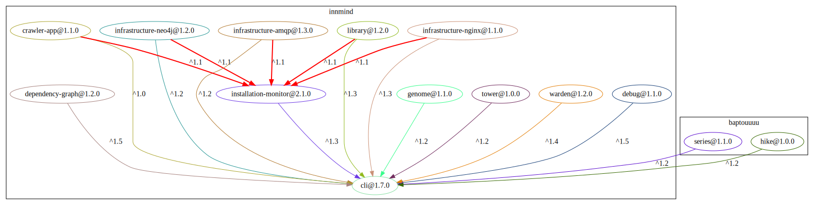
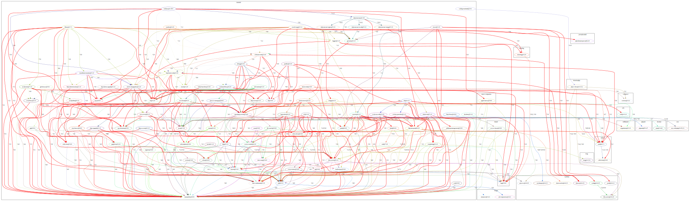

# DependencyGraph

[](https://github.com/Innmind/DependencyGraph/actions?query=workflow%3ACI)
[](https://codecov.io/gh/Innmind/DependencyGraph)
[](https://shepherd.dev/github/Innmind/DependencyGraph)

Tool to help visualize the various dependencies between packages.

It has been created to help maintain the many packages inside this organisation.

> [!NOTE]
> This package needs [graphviz (`dot` command line tool)](https://graphviz.org) to be installed on your machine

## Installation

```sh
composer global require innmind/dependency-graph
```

## Usage

`dependency-graph from-lock`

This command will look for a `composer.lock` in the working directory and generate a file named `dependencies.svg`.

`dependency-graph of {vendor}/{package}`

This will call `packagist.org` to retrieve the last published version of the given package and generate a file named `{vendor}_{package}_dependencies.svg`.

`dependency-graph depends-on {vendor}/{package} {vendor1} {vendorX}`

This will look for all packages inside the vendors `vendor1` and `vendorX` that depend (directly or indirectly) on `{vendor}/{package}` and will generate a file named `{vendor}_{package}_dependents.svg`.

**Note**: every package node and vendor cluster contains a link to their dedicated packagist page.

## Examples

`dependency-graph from-lock` of this repository 

`dependency-graph of innmind/cli` 

`dependency-graph depends-on innmind/cli innmind baptouuuu` 

`dependency-graph vendor innmind` 
